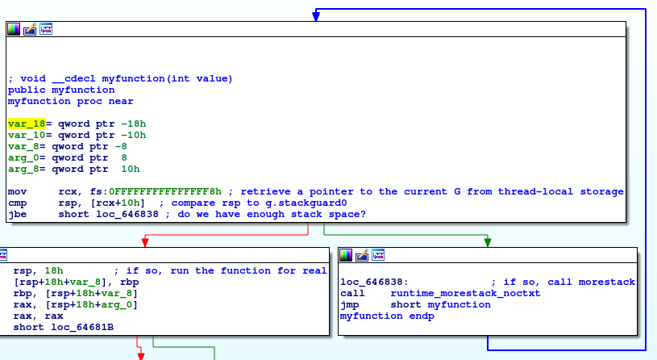

# Write-up for the Go runtime

## Basics

Unlike languages like Java, Go's runtime does *not* involve a virtual machine.
In this case, 'runtime' just refers to a library that implements features of the language like garbage collection and concurrency.
(This information is from https://golang.org/doc/faq#runtime. )
The source for the runtime can be found at https://github.com/golang/go/tree/master/src/runtime.
A Go package for interacting with the runtime can be found at https://golang.org/pkg/runtime/.

## Getting Runtime Information From Running Programs

In order to get debugging information from the runtime, we set the GODEBUG variable when launching the program.
For example, `GODEBUG=schedtrace=1000 ./test` will print information once every 1000 milliseconds about how the scheduler is performing.
(How many processors are idle, how many goroutines are queued for each processor, etc.)

Setting `scheddetail` to a number of milliseconds will print more detailed information.
For it to work, `schedtrace` must also be set.
(Example: `GOMAXPROCS=2 GODEBUG=schedtrace=1000,scheddetail=1000 ./test`)

More information about the GODEBUG variable can be found at https://golang.org/pkg/runtime/.

## Scheduler

Source code: https://github.com/golang/go/blob/4d7cf3fedbc382215df5ff6167ee9782a9cc9375/src/runtime/proc.go

### Structures

All structures are heap-allocated.
These data structures are *never* freed.
Instead, they are placed into a free pool for that specific type.

| Name | Description  | Stack |
|------|--------------|-------|
| G    | Goroutine    |  Dynamically growing/shrinking user stack (used for the execution of the Go code itself)     |
| M    | OS thread   |  Fixed-size system stack (and signal stack on Unix) |
| P | CPU resource | N/A |

(Source: https://github.com/golang/go/blob/master/src/runtime/HACKING.md)

G source code: https://github.com/golang/go/blob/5dd978a283ca445f8b5f255773b3904497365b61/src/runtime/runtime2.go#L332

M source code: https://github.com/golang/go/blob/5dd978a283ca445f8b5f255773b3904497365b61/src/runtime/runtime2.go#L403

P source code: https://github.com/golang/go/blob/5dd978a283ca445f8b5f255773b3904497365b61/src/runtime/runtime2.go#L470

### Behavior

The Go scheduler is [partially pre-emptive](https://github.com/golang/go/issues/11462) and work-stealing.

Every P has a queue of goroutines that are ready to be run.
There is also a global queue of goroutines.
If a P runs out of work, it will first look in the global queue.
If the global queue is empty, it will then try to steal work from another P.

An M must own a P in order to execute user Go code.
When M is not executing user code, e.g. when it is performing a syscall, it does not need a P and therefore will release it.
When the M wants to resume executing user code, it will need to reaquire a P.

A goroutine can yeild to another goroutine by calling `runtime.Gosched()`.

### Settings

The number of P can be set at execution time with the GOMAXPROCS variable. e.g.:

>GOMAXPROCS=4 ./test

Or, inside the code itself:

> runtime.GOMAXPROCS(4)

## Memory Management

### Allocation

Allocator source: https://github.com/golang/go/blob/5dd978a283ca445f8b5f255773b3904497365b61/src/runtime/malloc.go#L550

Memory allocation works differently for small and large objects.

#### Small objects

Go has a set of size classes, defined [here](https://github.com/golang/go/blob/7ee43faf78f3b0c97c315c28f13dd802047af0c8/src/runtime/mksizeclasses.go).
Every P has a cache of mspans: spans of pages which are themselves split into segments of a given size class.
Within each mspan, a bitmap is used to mark which segments are free and which have been allocated.
When a small object is allocated, Go takes the smallest size class that can fit the object and looks at the bitmap for its mspan to see if there is free memory of that size.
If so, that memory is allocated.
If not, the allocator gives the P a new mspan for that size, then allocates from there.

This method of allocation reduces fragmentation (which is important, because the garbage collector is non-compacting).

#### Large Objects

Source code for allocation of large objects: https://github.com/golang/go/blob/5dd978a283ca445f8b5f255773b3904497365b61/src/runtime/malloc.go#L779

Large objects are allocated directly from the heap.

### Garbage Collection

Go's garbage collector is concurrent mark-sweep with a write barrier. 

Garbage collector source: https://github.com/golang/go/blob/5dd978a283ca445f8b5f255773b3904497365b61/src/runtime/mgc.go

## Scheduler Reflexivity

The scheduler itself is written in go.
How does this work? Who schedules the scheduler?

The short answer is that because go is compiled code, it can be its own runtime just by limiting the features it uses during startup and scheduling.
The long answer is more complicated and requires a dive into some very nitty-gritty internals.

### Startup

First, let's do an analysis of how a go process starts up.
There is a small amount of code written in assembly for each architecture, for example in [runtime/arch_amd64.s](https://github.com/golang/go/blob/4d7cf3fedbc382215df5ff6167ee9782a9cc9375/src/runtime/asm_amd64.s).
The entry point for a process is the `runtime·rt0_go` function.
Lord knows why go uses a unicode dot for package path delimiters in its assembly but there's really nothing to be done about that other than use a regex search and type a normal dot whenver you need to search for it.

The bulk of the work is basically initializing all the data structures that all go code expects to be able to use, and then setting up the process state such that there is exactly one goroutine: `runtime.main()`.
This goroutine is known as `g0`, stored as a global variable in the `runtime` module.
Additionally, every M also has a g0, so there's a "root g0" for the process itself and then a "thread-local g0" attached to each M.
Notably, many parts of the runtime have special handling for one or more of the root and thread-local g0s.

As an aside at this point we would like to glare derisively at the go devs for their variable and type naming schemes.

A particularly confusing part of this affair is that "launching a goroutine" involves messing with stacks.
Let's investigate that.

### How do we represent stacks anyway?

There's all this discussion of having several system stacks and several user stacks, but coming from a systems background it may be unclear how this is actually implemented.

First and foremost - "the current stack" ALWAYS refers to the region of memory pointed to by the stack pointer, in our case the `rsp` register.
It is then the job of the compiler to generate code which makes sure that when we push and pop stack frames (largely the same way C does it), we actually have the space to do so.

[This blog post](https://blog.cloudflare.com/how-stacks-are-handled-in-go/) from cloudflare explains the algorithms for how multiple stacks work.
The gist of it is that every function compiled from go code, unless specified otherwise with a compiler directive, starts with the following block of code:

The `morestack` method performs the aforementioned "stack split" or "stack copy" (two methods to handle running out of room), and will gruesomely manipulate the stack before return.
It will, however, maintain the invariant that rsp points to a region of memory that we can use as a stack, specifically pointing to a return address for the code to return to.
It may change which address the method returns to in order to give itself a callback for performing more stack bookkeeping, but that should be transparent to the code itself.

`morestack` is [implemented in assembly as well](https://github.com/golang/go/blob/4d7cf3fedbc382215df5ff6167ee9782a9cc9375/src/runtime/asm_amd64.s#L415).
Notably, it contains special code that checks if the current goroutine is either the g0 for the current M, or the gsignal (another special per-M goroutine).
If so, it will panic and abort, since these stacks may not be extended.

This indicates that these stacks are in fact the "real stacks", the ones allocated by the operating system for each of the threads, and that all the other "stacks" are just ordinary regions of memory managed by the go runtime.

### The Magic

With the idea in mind that _stacks are just regions of memory_, and that we can switch between them fluidly, we can attack the question of how the scheduling control flow really works.
I'm still not sure _where_ the magic is precisely, but it now no longer feels impossible for go code to schedule itself.
Presumably, somewhere there are calls into the scheduler, and this function call may not return immediately.
Instead, it will examining the current program state and if it decides there's a better place to execute, it'll simply serialize the current goroutine's context and deserialize another's.
